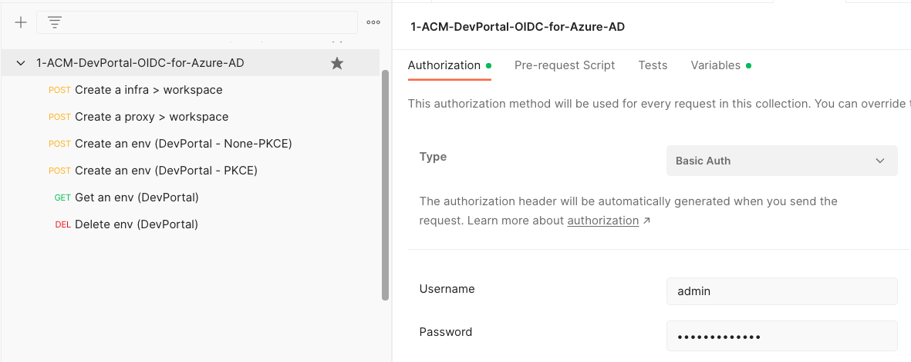
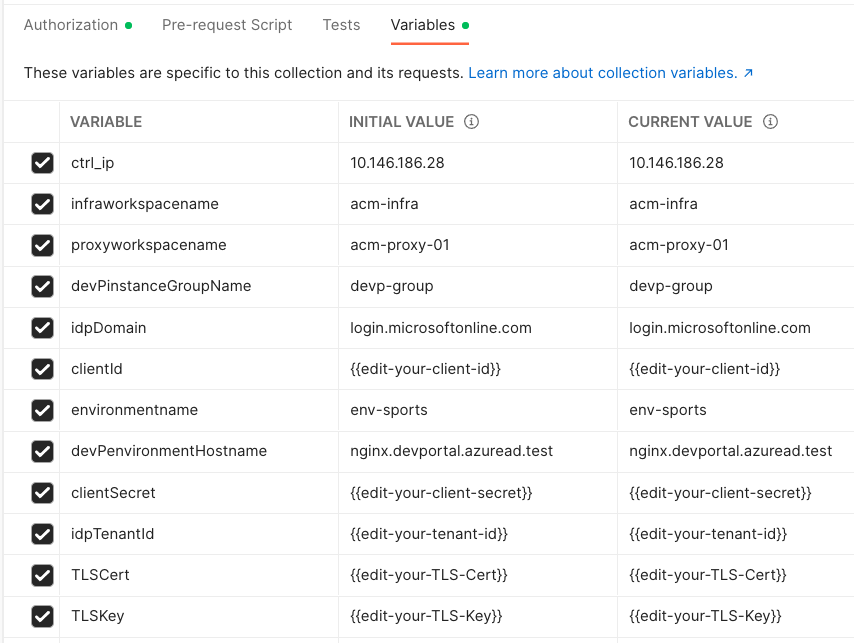

# How To Set Up NGINX ACM/DevPortal OIDC for Azure AD Integration

Take the following steps to set up NGINX ACM/DevPortal OIDC and test it for Azure AD integration.

## 1. Prerequisites

- [**Set up Azure AD**](./01-IdP-Setup.md)

  Ensure that you use **different application and callback/logout URLs** as the following example unlike that are already created to test your [containerized NGINX Plus](./02-NGINX-Plus-Setup.md).

  | Category                 | Example                                         |
  | ------------------------ | ----------------------------------------------- |
  | Application Name         | `nginx-devportal-app`                           |
  | Redirect URIs            | `https://nginx.devportal.azuread.test/_codexch` |
  | Front-channel logout URL | `https://nginx.devportal.azuread.test/_logout`  |

- Edit `hosts` file in your laptop via if you want to locally test your app:

  ```bash
  $ sudo vi /etc/hosts
  127.0.0.1 nginx.devportal.azuread.test
  ```

## 2. Install NGINX API Connectivity Manager

- [Download NGINX Management Suite](https://docs.nginx.com/nginx-management-suite/)

- [Install NGINX API Connectivity Manager](https://docs.nginx.com/nginx-management-suite/admin-guides/installation/install-guide/)

## 3. Set Up NGINX Dev Portal

Configure a Dev Portal by either referencing **NGINX Management Suite Docs** of [How To Set Up a NGINX Dev Portal](https://docs.nginx.com/nginx-management-suite/acm/getting-started/add-devportal/) or taking the following steps of calling APIs:

> **Note**:
>
> [Download an example of postman collection](./ACM-DevPortal-OIDC-for-Amazon-Cognito.postman_collection.json) for easily testing the following steps.

- Open a Postman collection, and edit ACM password and variables:
  
  

- Create a `infra > workspace`:

  > `POST https://{{ctrl_ip}}/api/acm/v1/infrastructure/workspaces`
  >
  > `Body`:
  >
  > ```json
  > {
  >   "name": "{{infraworkspacename}}"
  > }
  > ```

- Create a `proxy > workspace`:

  > `POST https://{{ctrl_ip}}/api/acm/v1/services/workspaces`
  >
  > `Body`:
  >
  > ```json
  > {
  >   "name": "{{proxyworkspacename}}"
  > }
  > ```

- Create an environment of `Dev Portal`:
  post_json = load("./json/01-create-env.json")

  ```json
  post_json['name']
  ```

  > `POST https://{{ctrl_ip}}/api/acm/v1/infrastructure/workspaces/{{infraworkspacename}}/environments`
  >
  > `Body`:
  >
  > ```json
  > {
  >   "name": "{{environmentname}}",
  >   "functions": ["DEVPORTAL"],
  >   "proxies": [
  >     {
  >       "proxyClusterName": "{{devPinstanceGroupName}}",
  >       "hostnames": ["{{devPenvironmentHostname}}"],
  >       "runtime": "PORTAL-PROXY",
  >       "policies": {
  >         "oidc-authz": [
  >           {
  >             "action": {
  >               "jwksURI": "https://cognito-idp.{{idpRegion}}.amazonaws.com/{{idpUserPoolId}}/.well-known/jwks.json",
  >               "tokenEndpoint": "https://{{idpDomain}}/oauth2/token",
  >               "userInfoEndpoint": "https://{{idpDomain}}/oauth2/userInfo",
  >               "authorizationEndpoint": "https://{{idpDomain}}/oauth2/authorize",
  >               "logOffEndpoint": "https://{{idpDomain}}/logout",
  >               "logOutParams": [
  >                 {
  >                   "paramType": "QUERY",
  >                   "key": "returnTo",
  >                   "value": "http://{{devPenvironmentHostname}}/_logout"
  >                 },
  >                 {
  >                   "key": "client_id",
  >                   "paramType": "QUERY",
  >                   "value": "{{clientId}}"
  >                 }
  >               ],
  >               "TokenParams": [
  >                 {
  >                   "paramType": "HEADER",
  >                   "key": "Accept-Encoding",
  >                   "value": "gzip"
  >                 }
  >               ]
  >             },
  >             "data": [
  >               {
  >                 "clientID": "{{clientId}}",
  >                 "clientSecret": "{{clientSecret}}",
  >                 "scopes": "openid+profile+email"
  >               }
  >             ]
  >           }
  >         ]
  >       }
  >     }
  >   ]
  > }
  > ```

- Get an environment of `Dev Portal`:

  > `GET https://{{ctrl_ip}}/api/acm/v1/infrastructure/workspaces/{{infraworkspacename}}/environments`
  >
  > `Response`:
  >
  > ```
  > {
  >     :
  >     curl -k https://<CTRL-FQDN>/install/nginx-agent > install.sh && sudo sh install.sh -g devp-group && sudo systemctl start nginx-agent
  >     :
  > }
  > ```

- SSH into the instance of Dev Portal, and run the following commands:

  ```ssh
  curl -k https://<CTRL-FQDN>/install/nginx-agent > install.sh && sudo sh install.sh -g devp-group && sudo systemctl start nginx-agent
  ```

- Option 1. Upsert an environment of `Dev Portal` for `none-PKCE`

  > `PUT https://{{ctrl_ip}}/api/acm/v1/infrastructure/workspaces/{{infraworkspacename}}/environments/{{environmentname}}`
  >
  > `Body`:
  >
  > ```json
  > {
  >   "name": "{{environmentname}}",
  >   "type": "NON-PROD",
  >   "functions": ["DEVPORTAL"],
  >   "proxies": [
  >     {
  >       "proxyClusterName": "{{devPinstanceGroupName}}",
  >       "hostnames": ["{{devPenvironmentHostname}}"],
  >       "runtime": "PORTAL-PROXY",
  >       "listeners": [
  >         {
  >           "ipv6": false,
  >           "isTLSEnabled": false,
  >           "port": 80,
  >           "transportProtocol": "HTTP"
  >         }
  >       ],
  >       "policies": {
  >         "oidc-authz": [
  >           {
  >             "action": {
  >               "authFlowType": "AUTHCODE",
  >               "authorizationEndpoint": "https://{{idpDomain}}/oauth2/authorize",
  >               "jwksURI": "https://cognito-idp.{{idpRegion}}.amazonaws.com/{{idpUserPoolId}}/.well-known/jwks.json",
  >               "logOffEndpoint": "https://{{idpDomain}}/logout",
  >               "logOutParams": [
  >                 {
  >                   "key": "returnTo",
  >                   "paramType": "QUERY",
  >                   "value": "http://{{devPenvironmentHostname}}/_logout"
  >                 },
  >                 {
  >                   "key": "client_id",
  >                   "paramType": "QUERY",
  >                   "value": "{{clientId}}"
  >                 }
  >               ],
  >               "tokenEndpoint": "https://{{idpDomain}}/oauth2/token",
  >               "tokenParams": [
  >                 {
  >                   "key": "Accept-Encoding",
  >                   "paramType": "HEADER",
  >                   "value": "gzip"
  >                 }
  >               ],
  >               "uris": {
  >                 "loginURI": "/login",
  >                 "logoutURI": "/logout",
  >                 "redirectURI": "/_codexch",
  >                 "userInfoURI": "/userinfo"
  >               },
  >               "userInfoEndpoint": "https://{{idpDomain}}/oauth2/userInfo"
  >             },
  >             "data": [
  >               {
  >                 "appName": "nginx-devportal-app",
  >                 "clientID": "{{clientId}}",
  >                 "clientSecret": "{{clientSecret}}",
  >                 "scopes": "openid+profile+email",
  >                 "source": "ACM"
  >               }
  >             ]
  >           }
  >         ]
  >       }
  >     }
  >   ]
  > }
  > ```

- Option 2. Upsert an environment of `Dev Portal` for `PKCE`:

  > `PUT https://{{ctrl_ip}}/api/acm/v1/infrastructure/workspaces/{{infraworkspacename}}/environments/{{environmentname}}`
  >
  > `Body`:
  >
  > ```
  > {
  >        :
  >   "authFlowType": "PKCE",
  >        :
  >   "clientSecret": "",
  >        :
  > }
  > ```

## 3. Test Dev Portal OIDC with Azure AD

- Open a web browser and access the Dev Portal's FQDN like `http://nginx.devportal.cognito.test`.
- Try `Login` and `Logout`.
- Test the above TWO steps after changing IdP (PKCE option) and updating Dev Portal via NGINX ACM API.
